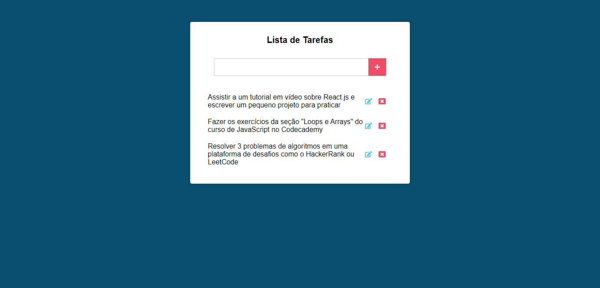

# Attendace List
Projeto Criado na Seção React com Classes e Componentes do Curso JavaScript e TypeScript do Básico ao Avançado

## Tecnologias utilizadas

+ HTML5
+ CSS3
+ JavaScript
+ ReactJS

## Estrutura do site

+ Input: Seção onde é possível adicionar a tarefa a ser realizada
+ Cards: Seção onde é possível ver as tarefas, editar e excluir as mesmas

## Dark Theme

